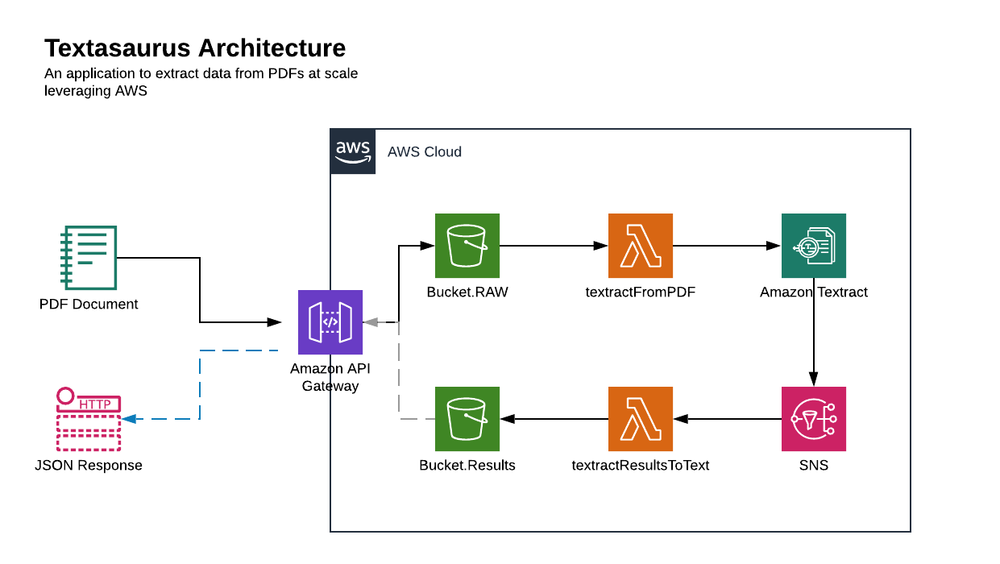

# Textasaurus
A simple library for extracting text from any PDF in Python x AWS.



## Getting Started

### 1. Install Textasaurus
```bash
pip install textasaurus
```

### 2. Add ENV variables

### 3. Run Textasaurus
```bash
textasarurs run -p 8080
```

## Use Cases